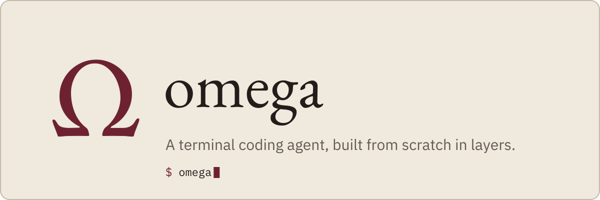
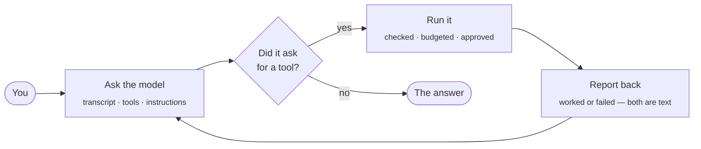
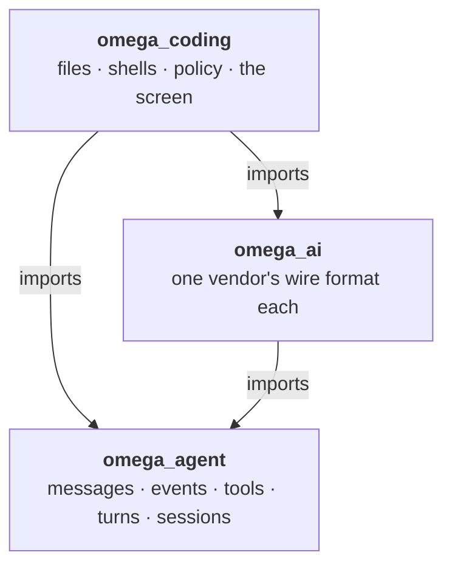
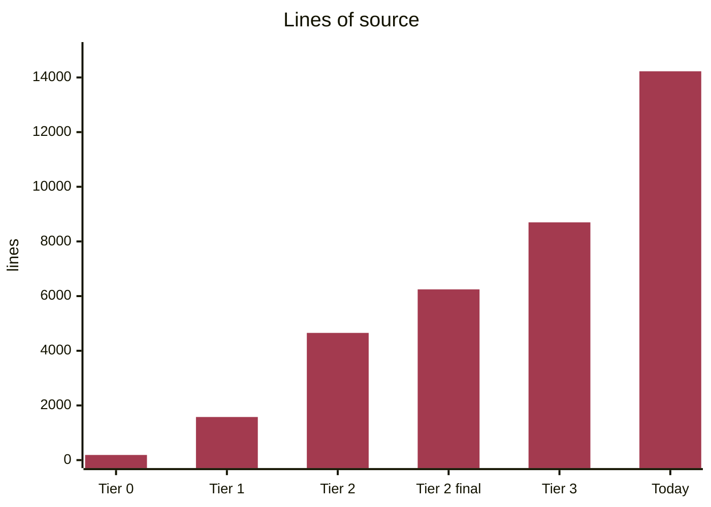

<p align="center">
  <picture>
    <source media="(prefers-color-scheme: dark)" srcset=".github/assets/omega-banner-dark.svg">
    
  </picture>
</p>

<p align="center">
  <a href="https://github.com/ruseellkj/omega/actions/workflows/ci.yml"></a>
  
  
  
</p>

<p align="center">
  <a href="https://omega-coding-agent.vercel.app"><b>Website</b></a> ·
  <a href="#quickstart">Quickstart</a> ·
  <a href="#how-it-works">How it works</a> ·
  <a href="#the-journey-tier-by-tier">The journey</a> ·
  <a href="#using-omega">Using omega</a> ·
  <a href="#roadmap-parity-with-pi-and-tau">Roadmap</a> ·
  <a href="omega/READING-ORDER.md">Read the code</a>
</p>

---

**omega** is a terminal coding agent written in Python — small enough to read end to end. It
started as a single 188-line file and grew, one tier at a time, into a layered agent with a
terminal UI, persistent sessions, compaction, prompt caching and browser sign-in.

> A coding agent is a program that asks a model for help, does what the model asks for, tells it
> what happened, and repeats until it says it is finished.

> [!NOTE]
> omega is a **study-then-build** project. The goal is understanding, not shipping: every tier was
> written down as a contract before the code, measured when it closed, and corrected wherever
> reality disagreed. Two MIT-licensed agents, [Pi](https://github.com/earendil-works/pi) and
> [Tau](https://github.com/huggingface/tau), were the teaching material — see [Credits](#credits).

## Contents

- [Quickstart](#quickstart)
- [How it works](#how-it-works)
- [Architecture](#architecture)
- [The journey, tier by tier](#the-journey-tier-by-tier)
  - [Tier 0 — the prototype](#tier-0--the-prototype)
  - [Tier 1 — the loop works](#tier-1--the-loop-works)
  - [Tier 2 — safe on a real repository](#tier-2--safe-on-a-real-repository)
  - [Tier 3 — survives a long task, and has a face](#tier-3--survives-a-long-task-and-has-a-face)
  - [Beyond the tiers — a product](#beyond-the-tiers--a-product)
  - [Growth, measured](#growth-measured)
- [Using omega](#using-omega)
- [Roadmap: parity with Pi and Tau](#roadmap-parity-with-pi-and-tau)
- [Project layout](#project-layout)
- [Development](#development)
- [Documentation](#documentation)
- [Credits](#credits)

## Quickstart

One line. It installs [**uv**](https://docs.astral.sh/uv/) if it is missing, puts omega in its own
environment, checks the command it created, and never edits a shell rc file:

```bash
curl -fsSL https://omega-coding-agent.vercel.app/install.sh | sh
```

Already have uv? This is the install the script runs:

```bash
uv tool install "git+https://github.com/ruseellkj/omega#subdirectory=omega"
```

```bash
omega                            # the terminal UI — this is the whole command
omega --fake                     # scripted responses: no key, no network, no credits
omega -p "fix the failing test"  # one shot: the answer on stdout, then exit — pipeable
```

Inside omega, **`/login`** signs you in — with a Claude or ChatGPT subscription in the browser, or
with an API key. An exported `ANTHROPIC_API_KEY` or `OPENAI_API_KEY` works too.

<details>
<summary><b>Run it from a clone instead</b></summary>

The package lives in the `omega/` folder of this repository.

```bash
git clone https://github.com/ruseellkj/omega.git
cd omega/omega
uv sync
uv run omega --fake
```

</details>

## How it works

Everything omega does is one loop. It asks the model, runs whatever the model asks for, reports
what happened, and asks again — until the model stops asking.



That loop is [`loop.py`](omega/src/omega_agent/loop.py) — **190 lines**, against a self-imposed limit
of 250. It never makes policy. It *asks*, through [hooks](omega/src/omega_agent/hooks.py), and
everything that decides — approvals, redaction, compaction — plugs in from outside.

## Architecture

omega is three packages, and one question decides where any code goes: **what does this file know
about?**



| Package | Knows about | Never knows about |
|---|---|---|
| [`omega_agent`](omega/src/omega_agent/) | messages, events, tools, turns, sessions | files, vendors, terminals |
| [`omega_ai`](omega/src/omega_ai/) | one vendor's wire format | anything above it |
| [`omega_coding`](omega/src/omega_coding/) | files, shells, policy, the screen | — it is the top |

The arrows only point down, and that is enforced, not documented:
[`test_layers.py`](omega/tests/test_layers.py) parses every import and fails if a package reaches
upward.

The loop's seams, and what fills each one:

| Hook | Filled by |
|---|---|
| `before_tool_call` | the approval gate — asks before anything destructive |
| `after_tool_call` | credential masking on tool output |
| `before_record` | the same masking on every message, before it is stored |
| `convert_to_llm` | drops empty failed turns from the request |
| `transform_context` | compaction — keeps a long conversation under the model's window |
| `get_steering_messages` / `get_follow_up_messages` | queues you can type into while it works |

## The journey, tier by tier

Point a minimal coding agent at a real repository and it fails in **nine specific ways** —
catalogued in [`02-beginner.md`](dev-notes/03-architecture/02-beginner.md). Not one of the fixes
belongs in the loop. Each tier was a contract to close some of them, written before its code:

| # | Failure | Fixed in |
|---:|---|---|
| 1 | The context fills up and the run dies | Tier 3 — compaction |
| 2 | One big file or command output ends the session | Tier 1 — output truncation |
| 3 | Ctrl-C bricks the conversation | Tier 2 — cancellation and transcript repair |
| 4 | `run_shell` eventually deletes something you wanted | Tier 2 — the approval gate |
| 5 | A rate limit ends the run | Tier 2 — retry with backoff |
| 6 | Nothing appears until the model finishes | Tier 1 — streaming |
| 7 | Switching providers means a rewrite | Tier 1 — one provider interface |
| 8 | Two edits to one file lose data | Tier 2 — a per-path write lock |
| 9 | It costs more than it should | Tier 3 — prompt caching |

### Tier 0 — the prototype

**[`agent.py`](agent.py) · 188 lines · one file**

The starting point: a single script with three tools (`read_file`, `write_file`, `run_shell`), a
25-turn cap, one provider, and no streaming — it waits for the whole reply. It genuinely works, and
that is exactly what makes it misleading: every one of the nine failures above is still in it.

```bash
# from the repository root, with ANTHROPIC_API_KEY in .env — see .env.sample
uv run --with anthropic --with python-dotenv agent.py
```

It is a lone script, not a project, so `--with` brings its two dependencies along for the run.

The even smaller teaching version — seventy lines, and the nine ways it breaks — is in
[`02-beginner.md`](dev-notes/03-architecture/02-beginner.md).

### Tier 1 — the loop works

**2026-08-22 · tag [`tier-1`](https://github.com/ruseellkj/omega/tree/tier-1) · 1,577 lines · 45 tests**

A working agent with real layers. It streams, it calls tools, it stops correctly, and its provider
is swappable — closing failures **2**, **6** and **7**. It is not yet safe, persistent or
interruptible, and each of those became a Tier 2 addition to a seam that already existed rather
than a rewrite. → [`TIER-1.md`](omega/TIER-1.md)

### Tier 2 — safe on a real repository

**2026-08-24 · tag [`tier-2`](https://github.com/ruseellkj/omega/tree/tier-2) · 4,654 lines · 289 tests**

It can be interrupted without corrupting the conversation, it remembers across restarts, and it
asks before it destroys anything — closing failures **3**, **4**, **5** and **8**. Adding a second
provider, OpenAI Chat Completions, changed nothing above the provider layer: the abstraction
stopped being a claim and became a measured result.

The work that followed closed at tag
[`tier-2-final`](https://github.com/ruseellkj/omega/tree/tier-2-final) (2026-09-16 · 6,247 lines ·
395 tests): a location-aware approval gate in place of a hard path fence, slash commands, a `!`
shell escape, and a single event loop. → [`TIER-2.md`](omega/TIER-2.md)

### Tier 3 — survives a long task, and has a face

**2026-09-17 · 8,699 lines · 512 tests**

Compaction and prompt caching closed the last two failures, **1** and **9**. A Textual terminal UI
made steering reachable by a person rather than only by a test — and it needed no new agent events:
it reads the same ten the plain REPL does. Session branching, search tools, structured logging,
image reading and subagents shipped alongside. Tier 3's size estimate was also the first in the
project not to run low. → [`TIER-3.md`](omega/TIER-3.md)

### Beyond the tiers — a product

**Today (2026-09-23) · 14,226 lines · 713 tests**

With every beginner failure closed, the work moved from the tier scorecard to the
[product backlog](omega/PRODUCT-BACKLOG.md):

- **Sign-in** — browser OAuth for a Claude or ChatGPT subscription, or an API key, stored at `0600`
- **A model catalog** — built-in context windows read from [models.dev](https://models.dev),
  `/model refresh` to update them, and your own `~/.omega/models.json` on top
- **`/context`** — how full the window is, and what is filling it: system, messages, tools, free
- **Shipping** — CI on every push, and a PyPI publish on every published GitHub Release
  ([`ci.yml`](.github/workflows/ci.yml), [`publish.yml`](.github/workflows/publish.yml))

### Growth, measured

Every figure below was measured from the code at that point — lines counted from the tree at that
commit, tests collected by running the suite there. Tier 3 has no tag; it is measured at the commit
that closed it.



```mermaid
%%{init: {"themeVariables": {"xyChart": {"plotColorPalette": "#A33A4F"}}}}%%
xychart-beta
    title "Tests"
    x-axis ["Tier 1", "Tier 2", "Tier 2 final", "Tier 3", "Today"]
    y-axis "tests" 0 --> 800
    line [45, 289, 395, 512, 713]
```

| Milestone | Date | Source files | Source lines | Tests |
|---|---|---:|---:|---:|
| Tier 0 — `agent.py` | — | 1 | 188 | — |
| Tier 1 | 2026-08-22 | 12 | 1,577 | 45 |
| Tier 2 | 2026-08-24 | 32 | 4,654 | 289 |
| Tier 2 final | 2026-09-16 | 38 | 6,247 | 395 |
| Tier 3 | 2026-09-17 | 46 | 8,699 | 512 |
| Today | 2026-09-23 | 57 | 14,226 | 713 |

Through all of it, `loop.py` has not grown past 190 lines.

## Using omega

### Commands in the conversation

A leading `/` talks to omega; a leading `!` runs a shell command through the same approval gate
the model uses. Everything else goes to the model.

| Command | What it does |
|---|---|
| `/help` | list these commands |
| `/login [provider]` | sign in — browser for a subscription, or an API key |
| `/logout [provider]` | remove a stored credential |
| `/model [name]` | switch model, keeping the conversation |
| `/model refresh` | refresh the model list and context windows from models.dev |
| `/context` | how full the context window is, and what is filling it |
| `/compact [pct]` | shrink the conversation now |
| `/cost` | tokens and spend so far |
| `/rewind [n]` | go back before your last question; the old branch is kept |
| `/sessions` | saved sessions for this project |
| `/resume <id>` | switch to another session |
| `/clear` | start a fresh session; the old one is kept |
| `/theme [name]` | slate, oxblood-dark, oxblood-light, high-contrast |
| `/exit` | leave omega |
| `!<command>` | run a shell command — no model, no tokens |

<details>
<summary><b>Keys in the terminal UI</b></summary>

| Key | What it does |
|---|---|
| `ctrl+c` | stop the turn in progress — press twice to quit when nothing is running |
| `ctrl+d` | quit |
| `esc` | close the palette, stop a turn and ask, or recall your last message |
| `↑` `↓` | walk back through what you typed — `↑` first recalls a message you queued mid-turn |
| `tab` | complete the highlighted command |
| `ctrl+o` | expand every tool row at once |
| `/` | open the command list, filtered as you type |

</details>

### Providers

| Provider | Sign in with | Notes |
|---|---|---|
| Anthropic | Claude subscription (browser) or API key | Messages API |
| OpenAI | API key | Chat Completions; `--base-url` also reaches Groq, Together, Ollama and vLLM |
| ChatGPT | ChatGPT subscription (browser) | the Responses API, through its own adapter |

### Tools the model can use

`read_file`, `write_file`, `edit_file`, `read_image`, `list_files`, `find_files`, `search_files` and
`run_shell` — plus `run_subagent`, which hands a task to a child agent under the same approval gate.
Every tool returns its errors as data, so a failed call is something the model can read and react
to, never a crash.

## Roadmap: parity with Pi and Tau

What Pi and Tau can do that omega cannot yet, checked against their source. Ticked items are ones
omega already matches.

> [!TIP]
> Evidence for every row: Pi's [`slash-commands.ts`](https://github.com/earendil-works/pi/blob/main/packages/coding-agent/src/core/slash-commands.ts)
> and Tau's [`commands.py`](https://github.com/huggingface/tau/blob/main/src/tau_coding/commands.py),
> plus the Tau modules linked inline.

**Sessions**

- [x] Resume a previous session — `/resume` *(Pi, Tau)*
- [x] Start a fresh session — `/clear` *(`/new` in Pi and Tau)*
- [x] Compact on demand — `/compact` *(Pi, Tau)*
- [ ] Name a session — `/name` *(Pi, Tau)*
- [ ] Session info and stats in one place — `/session` *(Pi, Tau)*; omega splits this across `/cost` and `/context`
- [ ] Browse and switch branches — `/tree` *(Pi, Tau)*; omega's `/rewind` goes back but cannot switch between branches
- [ ] Fork from an earlier message, or duplicate a session — `/fork`, `/clone` *(Pi)*
- [ ] Export a session as HTML or JSONL — `/export` *(Pi, Tau)*; import one back — `/import` *(Pi)*
- [ ] Share a session as a secret GitHub gist — `/share` *(Pi)*
- [ ] Copy the last reply to the clipboard — `/copy` *(Pi)*

**Models and providers**

- [x] Switch model mid-conversation — `/model` *(Pi, Tau)*
- [x] Browser sign-in and API keys — `/login`, `/logout` *(Pi, Tau)*
- [ ] Quick-cycle favourite models with `Ctrl+P` — `/scoped-models` *(Pi, Tau)*
- [ ] Thinking levels, from off to xhigh — [Tau `catalog.toml`](https://github.com/huggingface/tau/blob/main/src/tau_coding/data/catalog.toml)
- [ ] Custom providers from configuration — [Tau `provider_config.py`](https://github.com/huggingface/tau/blob/main/src/tau_coding/provider_config.py)
- [ ] GitHub Copilot sign-in — [Tau `oauth_github_copilot.py`](https://github.com/huggingface/tau/blob/main/src/tau_coding/oauth_github_copilot.py)
- [ ] Discover a model's limits live from the provider — [Tau `session.py`](https://github.com/huggingface/tau/blob/main/src/tau_coding/session.py)

**Extensibility**

- [ ] Skills — `/skill`, `/skills` · [Tau `skills.py`](https://github.com/huggingface/tau/blob/main/src/tau_coding/skills.py)
- [ ] Prompt templates — `/prompts` *(Tau)*
- [ ] Extensions — [Pi `extensions/`](https://github.com/earendil-works/pi/tree/main/packages/coding-agent/src/core/extensions)
- [ ] A settings menu — `/settings` *(Pi)*
- [ ] Reload keybindings, extensions, skills, prompts, themes and context files live — `/reload` *(Pi, Tau)*

**Interface**

- [x] Themes — `/theme` *(Tau)*
- [ ] Show every keyboard shortcut — `/hotkeys` *(Pi, Tau)*
- [ ] Show the active system prompt — `/system` *(Tau)*
- [ ] Browse the tools available to a session — `/tools` *(Tau)*
- [ ] Changelog in the app — `/changelog` *(Pi)*
- [ ] Remember a project's trust decision — `/trust` *(Pi)*

**Shipping omega**

- [x] CI on every push
- [x] A release-triggered PyPI publish workflow
- [x] An install script
- [ ] Claim `omega-coding` on PyPI and publish the first release
- [ ] Add a license
- [ ] A public website domain for the installer

## Project layout

```text
.
├── agent.py               Tier 0 — the 188-line prototype
├── omega/                 the agent
│   ├── src/
│   │   ├── omega_agent/   the loop, events, tools, sessions — knows nothing about files or vendors
│   │   ├── omega_ai/      one adapter per wire format
│   │   └── omega_coding/  tools, approvals, commands, the terminal UI — the application
│   ├── tests/             fully offline
│   ├── website/           the project site
│   ├── TIER-1.md          the contract for each tier, written before its code
│   ├── TIER-2.md
│   ├── TIER-3.md
│   └── PRODUCT-BACKLOG.md what comes after the tiers
├── dev-notes/             teardowns of Pi and Tau, architecture, concepts
└── .github/workflows/     CI and the PyPI release workflow
```

To read the code, start with [`READING-ORDER.md`](omega/READING-ORDER.md): every file, in the order
to read it, with one line on what it is. The full package documentation is in
[`omega/README.md`](omega/README.md).

## Development

```bash
cd omega
uv sync
uv run pytest -q                     # the whole suite — fully offline
uv run mypy --strict src             # must be clean
uv run ruff check .                  # must be clean
uv run python -m omega_coding.evals  # smoke eval, no network
```

Every change leaves all four green, and CI runs the same four on every push. Where there is a bug,
the convention is a red test that names the failure, then the fix.

## Documentation

The study notes behind omega live in [`dev-notes/`](dev-notes/). A suggested order:

| Document | What it is |
|---|---|
| [`01-plain.md`](dev-notes/03-architecture/01-plain.md) | how a coding agent works, with no jargon |
| [`02-beginner.md`](dev-notes/03-architecture/02-beginner.md) | a working seventy-line agent, and the nine ways it breaks |
| [`anatomy.md`](dev-notes/00-concepts/anatomy.md) | the components a coding agent can have, tiered |
| [`security.md`](dev-notes/00-concepts/security.md) | it runs shell commands on your machine, so this comes first |
| [`03-production.md`](dev-notes/03-architecture/03-production.md) | the real architecture: layers and boundaries |
| [`04-boundaries-and-layout.md`](dev-notes/03-architecture/04-boundaries-and-layout.md) | the boundaries, and the rule that arrows only point down |
| [`state-and-delegation.md`](dev-notes/00-concepts/state-and-delegation.md) | omega, Pi, Tau and Claude Code on sessions, retry and subagents |
| [`shipping-and-auth.md`](dev-notes/00-concepts/shipping-and-auth.md) | packaging, the installer, and signing in |
| [`01-teardown/`](dev-notes/01-teardown/) | a layer-by-layer teardown of Pi and Tau |
| [`04-glossary.md`](dev-notes/04-glossary.md) | every term, with an everyday analogy |
| [`04-folder-trees.md`](dev-notes/04-folder-trees.md) | how the architecture maps onto directories |
| [`06-product-roadmap.md`](dev-notes/06-product-roadmap.md) | from working to product |

[`scripts/build-pdf.sh`](scripts/build-pdf.sh) renders the notes into a single PDF.

## Credits

omega exists because two excellent open-source agents made the inside of a coding agent readable.

- **[Pi](https://github.com/earendil-works/pi)** ([pi.dev](https://pi.dev)) — TypeScript, MIT. The
  exemplar: a minimal agent harness, and the production-grade reference for how a coding agent
  should be built.
- **[Tau](https://github.com/huggingface/tau)** ([twotimespi.dev](https://twotimespi.dev)) — Python,
  MIT, a port of Pi. Small enough to read like a textbook, with its reasoning kept in the open.

omega shares no code with either. Both were read, compared and taken apart; then omega was written
from scratch. Where the two agreed, that was treated as the architecture. Where they differed,
omega's notes record which way it went, and why.

---

<p align="center">
  <sub>Made with ❤️ from <b>Ω omega</b></sub>
</p>
